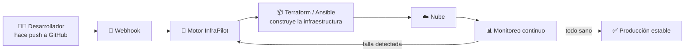

<div align="center">

# 🚀 InfraPilot

### De cero a infraestructura en producción con **un solo comando**.
### Y si algo se rompe, **se arregla solo**.


**Automatización de infraestructura digital, sin equipos de 20 personas.**

</div>

---

## ⏱️ Lectura de 60 segundos (para quien solo tiene un minuto)

| | |
|---|---|
| 😩 **Problema** | Desplegar y mantener infraestructura es lento, caro y propenso a errores humanos. |
| 💡 **Solución** | InfraPilot convierte una descripción simple en servidores, redes y monitoreo funcionando, y los repara automáticamente. |
| 🎯 **Cliente** | Startups y PyMEs que necesitan nivel "gran empresa" en infraestructura sin contratar un ejército de DevOps. |
| 💰 **Modelo** | Suscripción mensual por entorno gestionado (SaaS). |
| 🙋 **Lo que pedimos** | **$10M USD** para pasar de MVP a producto listo para clientes. |

---

## 😩 El problema

Hoy, montar infraestructura sigue pareciéndose más a un trabajo artesanal que a ingeniería:

- 🐌 **Lento:** configurar servidores, redes y seguridad a mano toma días o semanas.
- 💸 **Caro:** requiere perfiles DevOps escasos y muy bien pagados.
- 🔥 **Frágil:** un cambio manual mal hecho puede tumbar un servicio en producción.
- 🌙 **Agotador:** las fallas ocurren a las 3 a.m. y alguien tiene que despertarse a resolverlas.

> Cada hora de caída es dinero perdido y clientes frustrados.

---

## 💡 La solución: InfraPilot

InfraPilot es un **piloto automático para tu infraestructura**. Tú describes lo que necesitas; la plataforma lo construye, lo vigila y lo corrige.

| Capacidad | Qué significa para el negocio |
|---|---|
| ⚡ **Despliegue en un comando** | Entornos completos en minutos, no en semanas. |
| 🩹 **Autorreparación** | Detecta fallas y las resuelve sin intervención humana. |
| 🔒 **Seguridad por defecto** | Buenas prácticas aplicadas desde el primer despliegue. |
| 📊 **Visibilidad total** | Un panel con estado, costos y alertas en tiempo real. |
| ♻️ **Reproducible** | Todo es código versionado en Git: auditable y reversible. |

---

## 🎬 Así se ve en acción

```bash
# 1. Describe tu infraestructura
infrapilot init mi-startup

# 2. Despliega todo con un solo comando
infrapilot deploy --env produccion

# ✅ 3 servidores, 1 balanceador de carga y monitoreo listos en minutos
# 🩹 Si un servidor falla, InfraPilot lo reemplaza automáticamente
```

> 📌 *Vista previa del CLI objetivo del producto.*

---

## ⚙️ Cómo funciona



**Flujo en simple:**

1. El equipo sube cambios a **GitHub** (Git como única fuente de verdad).
2. Un **Webhook** avisa a InfraPilot en tiempo real.
3. El motor aplica los cambios con **Infraestructura como Código**.
4. El **monitoreo** vigila todo; si algo falla, el ciclo se repite hasta corregirlo.

---

## 📈 Oportunidad de mercado

- ☁️ La adopción de la nube y la automatización sigue en crecimiento sostenido.
- 👷 Hay escasez de talento DevOps: las empresas pequeñas no pueden competir por él.
- 🧩 Las herramientas actuales son potentes pero **complejas**: InfraPilot las integra y simplifica.

| Segmento | Dolor principal | Cómo lo resolvemos |
|---|---|---|
| 🌱 Startups | Sin equipo DevOps | Infraestructura lista con un comando |
| 🏢 PyMEs | Costos y caídas | Autorreparación y costos visibles |
| 🎓 Educación y laboratorios | Entornos repetibles | Entornos desechables y reproducibles |

> *Nota: las cifras detalladas de mercado se presentan en la reunión con inversores.*

---

## 🛠️ Tecnologías


---

## 🗺️ Roadmap

- [x] 🧪 Prueba de concepto: despliegue automatizado desde GitHub
- [ ] 🔧 **Q1:** MVP con CLI y despliegue en un proveedor de nube
- [ ] 🩹 **Q2:** Motor de autorreparación y monitoreo
- [ ] 📊 **Q3:** Panel web con costos y alertas en tiempo real
- [ ] 🚀 **Q4:** Lanzamiento comercial y primeros clientes de pago
- [ ] 🌎 **Año 2:** Soporte multinube y expansión regional

---

## 💰 ¿En qué se usarían los $10,000,000 USD?

| Destino | Monto | % | Para qué |
|---|---:|---:|---|
| 👩‍💻 Ingeniería y producto | $4,000,000 | 40% | Equipo técnico, desarrollo del motor y el panel |
| 📣 Ventas y crecimiento | $2,500,000 | 25% | Marketing, alianzas y adquisición de clientes |
| 🔒 Seguridad y cumplimiento | $1,500,000 | 15% | Auditorías, certificaciones y pruebas de seguridad |
| ☁️ Infraestructura y operación | $1,000,000 | 10% | Nube, soporte y operación del servicio |
| 🛟 Reserva | $1,000,000 | 10% | Colchón para imprevistos |
| **Total** | **$10,000,000** | **100%** | |

---

## 👥 Equipo

| Persona | Rol |
|---|---|
| **María GCA** | Fundadora y Arquitecta de Infraestructura |

> Buscamos incorporar talento en ingeniería, ventas y seguridad con esta ronda.

---

## 📬 Contacto

¿Listos para ser parte de InfraPilot?

- 🐙 GitHub: [@MaryGCA](https://github.com/MaryGCA)
- 📂 Repositorio: [proyecto-gitignore](https://github.com/MaryGCA/proyecto-gitignore)

---

<div align="center">

**InfraPilot: tú construyes el producto, nosotros pilotamos la infraestructura.** ✈️

*Proyecto académico para la materia Automatización de Infraestructura Digital 2.*

</div>
